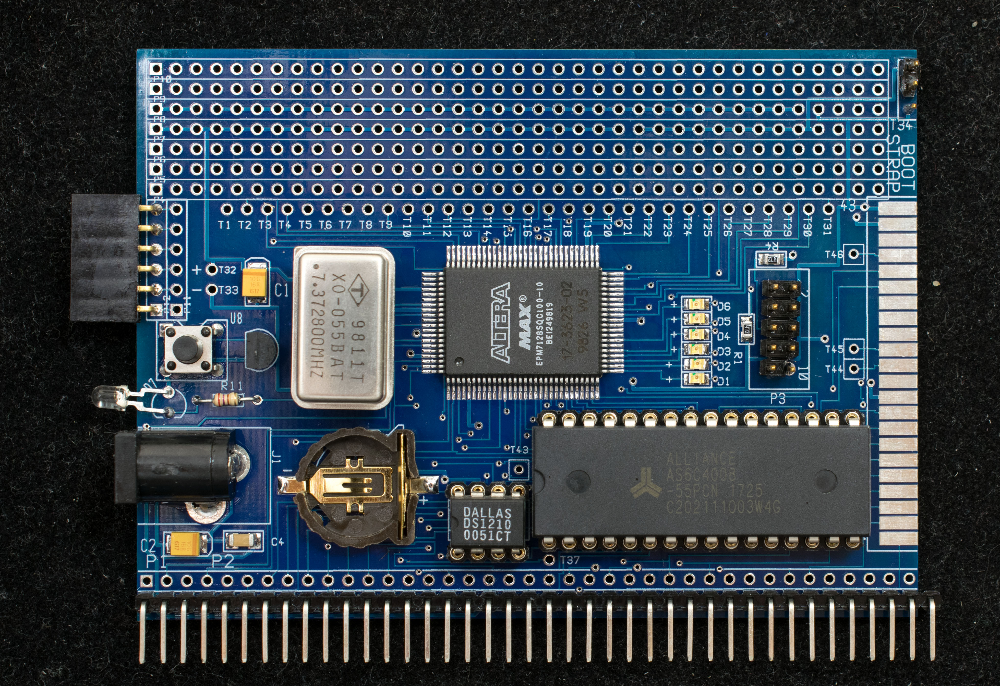

G8PP is a prototype board for 8-bit processors. The target processors are Z80, 8085, 680x, 6502, as well as 16-bit processors with 8-bit bus such as 68008 and 32008. G8PP is a RC2014 bus compatible module to take advantage of various I/O modules of the RC2014 family.

### Features
- 512K battery-backed RAM
- Altera EPM7128 CPLD
- Serial bootstrap capability
- Prototype area supporting 48-pin, 600mil wide DIP
- Compact flash interface
- RC2014 bus compatible
### Theory of Operation
G8PP is built around several common functions:

A programmable logic of sufficient complexity to support address decode and basic I/O. Programmable logic is needed because different processors have control signals with different functions and timings requirements. Altera EPM7128S is selected because it is a medium complexity 5V programmable logic that is still available.
A serial port with associated support logic that will perform the “Serial Bootstrap” function. This function, when enabled at power up, will receive a pre-determined number of serial data and store them in designated RAM locations. The support logic will tri-state the target processor's bus during serial bootstrapping. When the pre-determined number of data have received, the support logic will release the traget processor to run. The serial bootstrap functionaility is small enough to fit in the existing CPLD.
A battery-backed RAM that's large enough to fill the memory space of 8-bit processor plus extra memory to hold bootstrap code in nonvolatile memory banks. The traditional bootstrap code and monitor software resided in ROM are loaded and stored in the nonvolatile memory banks instead. This method simplifies the decoding of memory, reduces bus loading, and speeds up monitor software development cycle. The banked memory write-protect the bootstrap and monitor software and also give the application software complete control of the processor's memory space.
A 8-bit wide compact flash interface for mass storage.
A 48-pin 600-mil prototype socket for 5V 8-bit microprocessors from 1970's and 1980's. They include 680x, Z80, 8085 and 6502. 16-bit processors that can operate in 8-bit mode are also included such as 68008 and 32008. These processor are generally available in 40-pin or 48-pin DIP package that can plug directly into the prototype socket. The prototype socket has wiring pads to connect addresses, data, and control signals to the corresponding wiring pads on CPLD and RAM.
RC2014 bus interface so the target processor can access the large number of RC2014 I/O modules.
Modes of Operations
G8PP has two modes of operation as determined by the Bootstrap jumper at power up (see picture below for location of bootstrapjumper).

- UART Bootstrap
At power up the target processor is held in idle state until 255 bytes of instruction is uploaded to UART (115200 baud, N81, no handshake) which is then copied to memory starting from location 0x0. Afterward the CPU starts execution from 0x0. This is the mode to load programs into the non-volatile RAM prior to booting via the RAM bootstrap mode.

- RAM Bootstrap
This is normal mode of operation. At powerup, the target processor fetches program from physical location 0 which contains the bootstrap monitor. The bootstrap monitor write protect physical page 0 where bootstrap monitor resides. It then makes a copy of itself to 0xB000-0xBFFF and jump to it. Lastly the physical page 0 is replaced with logical page 0 which mapped to different physical page. This way the physical page 0 containing the bootstrap monitor is write protected and moved out of way. The application program will have unfettered access to all 64K space of the target processor.

### Design Information
- Schematic
- Gerber photoplots, the board was fabricated by Seeed Studio
- Altera EPM7128S design template
- Bill of Materials

- G8PP Baseline Configuration

## G8PP Projects
### G8PPZ80, Z80 is the target processor. The prototype runs at 22MHz. Run CP/M 2.2 and CP/M 3.
### G8PP68K8, MC68008 is the target processor. The prototype runs at 8MHz and run CP/M68K.
### G8PP8085, i8085 is the target processor.
### G8PP8080, i8080 is the target processor.
### G8PP6502, 6502 is the target processor. The prototype runs at 3.68MHz
### G8PP32K8, NS32008 is the target processor
### G8PP6809, MC6809 is the target processor

G8PP+X
This is two-board configuration pairing a G8PP to a simple processor board

G8PP + Z80

G8PP + 8085

G8PP + 6502

G8PP + 6809

G8PP + 68008
